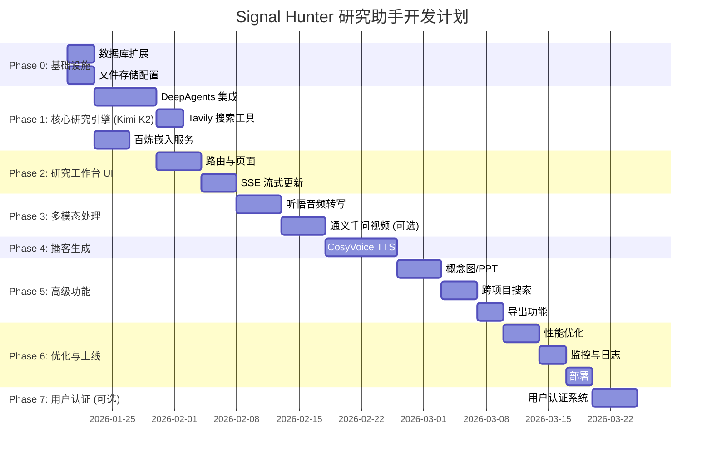

# Signal Hunter 研究助手 - 开发计划

> 版本: 2.1 | 日期: 2026-01-17 | 状态: 待启动

---

## 概述

本文档是**纯粹的开发计划**，聚焦于任务分解、依赖关系、时间线和里程碑。

**技术实现细节请查阅**:
- [主技术方案](./RESEARCH_ASSISTANT_TECHNICAL_DESIGN.md) - 系统架构、数据模型、API 设计
- [Agent 系统设计](./design/AGENT_SYSTEM.md) - DeepAgents 集成、Middleware、Tools、Skills
- [多模态处理设计](./design/MULTIMODAL_PROCESSING.md) - 听悟转写、通义千问 Omni、FFmpeg
- [播客生成设计](./design/PODCAST_GENERATION.md) - CosyVoice TTS、双 Agent 架构
- [前端组件设计](./design/FRONTEND_COMPONENTS.md) - 三栏布局、SSE、状态管理

---

## 1. 技术选型概览

| 领域 | 选型 | 参考文档 |
|------|------|----------|
| Agent 框架 | DeepAgents + LangGraph | AGENT_SYSTEM.md |
| 主 LLM (研究) | Kimi K2 (kimi-k2-thinking-turbo) | AGENT_SYSTEM.md |
| 对话 LLM | Kimi K2 (kimi-k2-turbo-preview) | AGENT_SYSTEM.md |
| 嵌入模型 | 百炼 通用文本向量-v3 | TECHNICAL_DESIGN.md |
| 音频转写 | 听悟 API (阿里云) | MULTIMODAL_PROCESSING.md |
| 视频处理 | 通义千问 Omni + yt-dlp (可选) | MULTIMODAL_PROCESSING.md |
| TTS | 百炼 CosyVoice | PODCAST_GENERATION.md |
| 网络搜索 | Tavily | TECHNICAL_DESIGN.md |
| 前端状态 | TanStack Query v5 + Zustand | FRONTEND_COMPONENTS.md |
| 认证 | NextAuth.js v5 (Phase 7 可选) | TECHNICAL_DESIGN.md |

---

## 2. 开发阶段总览

```
Week 1:    Phase 0 基础设施 (数据库 + 存储，无用户认证)
Week 2-4:  Phase 1 核心研究引擎
Week 5-6:  Phase 2 研究工作台 UI
Week 7-8:  Phase 3 多模态处理
Week 9-10: Phase 4 播客生成
Week 11-13: Phase 5 高级功能
Week 14-15: Phase 6 优化与上线
Week 16:   Phase 7 用户认证 (可选)
```

---

## 3. Phase 0: 基础设施 (Week 1)

### 3.1 数据库扩展

| ID | 任务 | 依赖 | 预估 | 交付物 |
|----|------|------|------|--------|
| P0-1 | 安装 pgvector 扩展 | - | 1h | 数据库配置 |
| P0-2 | 创建研究相关表 | P0-1 | 4h | 6 个新表 |
| P0-3 | 创建 HNSW 向量索引 | P0-2 | 2h | 索引配置 |
| P0-4 | 编写数据库迁移脚本 | P0-2 | 2h | migrations/ |

### 3.2 文件存储配置

| ID | 任务 | 依赖 | 预估 | 交付物 |
|----|------|------|------|--------|
| P0-5 | 创建 R2 Bucket | - | 1h | Cloudflare 配置 |
| P0-6 | 实现 S3 兼容客户端 | P0-5 | 2h | storage_service.py |
| P0-7 | 实现文件上传服务 | P0-6 | 3h | upload API |
| P0-8 | 实现预签名 URL | P0-6 | 2h | download API |

**Phase 0 交付**: 扩展数据库 + 文件存储

---

## 4. Phase 1: 核心研究引擎 (Week 2-4)

### 4.1 DeepAgents 集成

| ID | 任务 | 依赖 | 预估 | 交付物 |
|----|------|------|------|--------|
| P1-1 | 安装 DeepAgents 依赖 | - | 1h | requirements.txt |
| P1-2 | 设计 Agent 目录结构 | P1-1 | 2h | agents/ 目录 |
| P1-3 | 实现 PostgresBackend | P1-2, P0-2 | 6h | 状态持久化 |
| P1-4 | 实现 Research Agent (Kimi K2) | P1-3 | 8h | 主研究 Agent |
| P1-5 | 实现 Chat Agent (Kimi K2) | P1-4 | 4h | 对话 Agent |
| P1-6 | 实现 Summary Agent | P1-4 | 4h | 摘要子 Agent |
| P1-7 | 定义研究 Skills | P1-4 | 4h | SKILL.md 文件 |
| P1-8 | 实现 Agent 工具集 | P1-4 | 8h | tools/*.py |

### 4.2 搜索工具实现

| ID | 任务 | 依赖 | 预估 | 交付物 |
|----|------|------|------|--------|
| P1-9 | 实现 Tavily 搜索工具 | P1-8 | 3h | tavily_search tool |
| P1-10 | 实现向量搜索工具 | P1-8, P0-3 | 4h | vector_search tool |
| P1-11 | 实现搜索结果融合 | P1-9, P1-10 | 2h | RRF 算法 |

### 4.3 嵌入与分块 (百炼 通用文本向量-v3)

| ID | 任务 | 依赖 | 预估 | 交付物 |
|----|------|------|------|--------|
| P1-12 | 实现文本分块器 | - | 3h | text_splitter.py |
| P1-13 | 集成百炼嵌入服务 | P1-12 | 3h | embedding_service.py |
| P1-14 | 实现批量嵌入 | P1-13 | 3h | 异步批处理 |
| P1-15 | 实现增量更新 | P1-14 | 2h | 变更检测 |

**Phase 1 交付**: 完整的研究 Agent (Kimi K2) + Tavily 搜索 + 百炼嵌入引擎

---

## 5. Phase 2: 研究工作台 UI (Week 5-6)

### 5.1 路由与页面

| ID | 任务 | 依赖 | 预估 | 交付物 |
|----|------|------|------|--------|
| P2-1 | 创建 /research 路由 | - | 2h | 项目列表页 |
| P2-2 | 创建 /research/[id] 路由 | P2-1 | 2h | 工作台页面 |
| P2-3 | 实现研究项目列表 | P2-1 | 6h | ProjectList 组件 |
| P2-4 | 实现研究工作台 | P2-2 | 10h | Workspace 组件 |
| P2-5 | 实现材料选择器 | P2-4 | 4h | SourceSelector 组件 |
| P2-6 | 实现研究进度组件 | P2-4 | 6h | ResearchProgress 组件 |
| P2-7 | 实现对话区组件 | P2-4 | 8h | ChatPanel 组件 |

### 5.2 SSE 流式更新

| ID | 任务 | 依赖 | 预估 | 交付物 |
|----|------|------|------|--------|
| P2-8 | 实现后端 SSE 端点 | P1-4 | 4h | SSE API |
| P2-9 | 实现前端 SSE 客户端 | P2-8 | 3h | useSSE hook |
| P2-10 | 实现进度状态管理 | P2-9 | 3h | Zustand store |

**Phase 2 交付**: 完整的研究工作台 UI

---

## 6. Phase 3: 多模态处理 (Week 7-8)

### 6.1 音频转写 (听悟 API)

| ID | 任务 | 依赖 | 预估 | 交付物 |
|----|------|------|------|--------|
| P3-1 | 实现音频上传接口 | P0-7 | 3h | 上传 API |
| P3-2 | 集成听悟 API | P3-1 | 4h | TingwuClient |
| P3-3 | 实现转写任务队列 | P3-2 | 4h | 后台任务 |
| P3-4 | 实现转写进度跟踪 | P3-3 | 3h | SSE 进度 |
| P3-5 | 支持长音频分片 | P3-2 | 4h | FFmpeg 分片 |

### 6.2 视频处理 (可选，通义千问 Omni)

| ID | 任务 | 依赖 | 预估 | 交付物 |
|----|------|------|------|--------|
| P3-6 | 实现视频上传接口 | P0-7 | 3h | 上传 API |
| P3-7 | 集成通义千问 Omni API | P3-6 | 6h | QwenOmniClient |
| P3-8 | 实现视频理解功能 | P3-7 | 4h | 摘要 + 问答 |
| P3-9 | 实现 YouTube 导入 | P3-6 | 4h | yt-dlp 集成 |
| P3-10 | 实现视频摘要提取 | P3-8 | 4h | 章节摘要 |

**Phase 3 交付**: 听悟音频转写 + 通义千问视频理解 (可选)

---

## 7. Phase 4: 播客生成 (Week 9-10)

### 7.1 播客生成 Agent (百炼 CosyVoice)

| ID | 任务 | 依赖 | 预估 | 交付物 |
|----|------|------|------|--------|
| P4-1 | 设计播客 Skill | P1-7 | 3h | podcast/SKILL.md |
| P4-2 | 实现大纲生成 Agent | P4-1 | 6h | OutlineAgent |
| P4-3 | 实现对话生成 Agent | P4-2 | 6h | DialogueAgent |
| P4-4 | 集成百炼 CosyVoice TTS | P4-3 | 4h | CosyVoiceTTSEngine |
| P4-5 | 实现音频合成 | P4-4 | 4h | AudioPostProcessor |
| P4-6 | 实现播客预览 UI | P4-5 | 4h | 前端播放器 |

**Phase 4 交付**: 完整的播客生成流水线 (CosyVoice 多音色)

---

## 8. Phase 5: 高级功能 (Week 11-13)

### 8.1 概念图/PPT 生成

| ID | 任务 | 依赖 | 预估 | 交付物 |
|----|------|------|------|--------|
| P5-1 | 设计概念图 Skill | P1-7 | 2h | mindmap/SKILL.md |
| P5-2 | 集成 Mermaid.js | P5-1 | 4h | 图表渲染 |
| P5-3 | 实现图表生成 Agent | P5-2 | 6h | MindmapAgent |
| P5-4 | 实现 PPT 导出 | P5-3 | 6h | pptx 生成 |

### 8.2 跨项目搜索

| ID | 任务 | 依赖 | 预估 | 交付物 |
|----|------|------|------|--------|
| P5-5 | 实现全局向量搜索 | P1-11 | 4h | 跨项目搜索 API |
| P5-6 | 实现混合搜索 | P5-5 | 6h | BM25 + Vector + RRF |
| P5-7 | 实现搜索 UI | P5-6 | 4h | Cmd+K 搜索框 |

### 8.3 导出功能

| ID | 任务 | 依赖 | 预估 | 交付物 |
|----|------|------|------|--------|
| P5-8 | 导出 Markdown | P2-4 | 2h | MD 下载 |
| P5-9 | 导出 PDF | P5-8 | 4h | Puppeteer 渲染 |
| P5-10 | 导出 Notion | P5-8 | 4h | Notion API 集成 |

**Phase 5 交付**: 概念图 + 搜索 + 导出

---

## 9. Phase 6: 优化与上线 (Week 14-15)

### 9.1 性能优化

| ID | 任务 | 依赖 | 预估 | 交付物 |
|----|------|------|------|--------|
| P6-1 | 数据库查询优化 | - | 4h | 索引 + EXPLAIN 分析 |
| P6-2 | API 响应缓存 | P6-1 | 4h | Redis 缓存 |
| P6-3 | 前端代码分割 | - | 3h | Dynamic Imports |
| P6-4 | 图片/资源 CDN | - | 2h | Cloudflare 配置 |

### 9.2 监控与日志

| ID | 任务 | 依赖 | 预估 | 交付物 |
|----|------|------|------|--------|
| P6-5 | 集成 Sentry | - | 2h | 错误追踪 |
| P6-6 | 集成 LangSmith | P1-4 | 3h | Agent 追踪 |
| P6-7 | 配置日志收集 | - | 3h | Loguru + Loki |
| P6-8 | 创建监控仪表板 | P6-5, P6-7 | 4h | Grafana |

### 9.3 部署

| ID | 任务 | 依赖 | 预估 | 交付物 |
|----|------|------|------|--------|
| P6-9 | 更新 Docker 配置 | - | 2h | docker-compose.yml |
| P6-10 | 配置 CI/CD | P6-9 | 4h | GitHub Actions |
| P6-11 | 配置生产环境 | P6-10 | 4h | Railway + Cloudflare |
| P6-12 | 配置备份策略 | P6-11 | 2h | pg_dump + R2 |

**Phase 6 交付**: 生产就绪系统

---

## 10. Phase 7: 用户认证 (Week 16，可选)

> ⚠️ 此阶段为可选功能，可根据产品需求决定是否实现

### 10.1 用户认证系统

| ID | 任务 | 依赖 | 预估 | 交付物 |
|----|------|------|------|--------|
| P7-1 | 设计用户数据模型 | - | 2h | users 表 schema |
| P7-2 | 实现 JWT 认证中间件 | P7-1 | 4h | auth middleware |
| P7-3 | 实现注册/登录 API | P7-2 | 4h | /auth 端点 |
| P7-4 | 实现密码重置流程 | P7-3 | 3h | 邮件 + token 逻辑 |
| P7-5 | 前端集成 NextAuth.js v5 | P7-3 | 4h | auth 配置 |
| P7-6 | 实现 OAuth 登录 (GitHub) | P7-5 | 3h | OAuth provider |
| P7-7 | 实现用户 Profile 页面 | P7-5 | 3h | /profile 页面 |

**Phase 7 交付**: 完整的用户认证系统 (可选)

---

## 11. 任务依赖图 (Gantt)



---

## 12. 里程碑

| 里程碑 | 周次 | 交付物 | 验收标准 |
|--------|------|--------|----------|
| **M1** | Week 1 | 基础设施 | 数据库 + 文件存储就绪 |
| **M2** | Week 4 | 核心引擎 | Kimi K2 Agent 可执行研究任务，Tavily 搜索可用 |
| **M3** | Week 6 | 工作台 MVP | 用户可使用研究工作台 |
| **M4** | Week 8 | 多模态 | 听悟音频转写可用 |
| **M5** | Week 10 | 播客 | CosyVoice 双人播客可生成 |
| **M6** | Week 13 | 高级功能 | 概念图、搜索、导出可用 |
| **M7** | Week 15 | 上线 | 生产环境部署完成 |
| **M8** | Week 16 | 用户认证 (可选) | 用户可注册登录 |

---

## 13. 成本估算 (月度)

### 13.1 API 成本

| 服务 | 用量估算 | 单价 | 月成本 |
|------|---------|------|--------|
| Kimi K2 (研究 Agent) | 10M input + 2M output | ¥8/¥32 per 1M | ~¥144 (~$20) |
| Kimi K2 (对话 Agent) | 20M input + 5M output | ¥8/¥32 per 1M | ~¥320 (~$44) |
| 百炼 通用文本向量-v3 | 10M tokens | ¥0.35 per 1M | ~¥4 (~$1) |
| 听悟 API | 100 小时 | ~¥0.5/分钟 | ~¥3000 (~$410) |
| 百炼 CosyVoice | 500K 字符 | ~¥2/万字符 | ~¥100 (~$14) |
| 通义千问 Omni (可选) | 50 小时视频 | - | 按需计费 |
| Tavily | 5000 次 | $0.01/次 | ~$50 |
| **API 小计** | | | **~$540** |

> 💡 成本优化：Kimi K2 缓存命中时输入价格降至 ¥2/1M，可进一步降低成本

### 13.2 基础设施

| 服务 | 规格 | 月成本 |
|------|------|--------|
| Railway (Backend) | Pro | $20 |
| Railway (PostgreSQL) | 4GB | $20 |
| Cloudflare Pages | Pro | $20 |
| Cloudflare R2 | 100GB | $5 |
| **基础设施小计** | | **~$65** |

### 13.3 总成本

**预估月度总成本: ~$605** (较原方案节省 ~36%)

---

## 14. 风险与缓解

| 风险 | 影响 | 概率 | 缓解措施 |
|------|------|------|----------|
| DeepAgents 框架不成熟 | 开发延期 | 中 | 准备 LangGraph 纯实现备用 |
| API 成本超预期 | 预算超支 | 中 | 实现用量追踪 + 告警 + 限额 |
| 视频处理性能 | 用户等待 | 高 | 后台处理 + 进度通知 + 邮件 |
| CosyVoice 并发限制 | 播客生成慢 | 中 | 队列 + 批量处理 |
| 向量搜索性能 | 搜索延迟 | 低 | HNSW 索引 + 结果缓存 |
| 听悟 API 稳定性 | 转写中断 | 低 | 重试机制 + 分片处理 |

---

## 15. 资源需求

### 15.1 开发环境

| 资源 | 配置 |
|------|------|
| 开发机 | macOS / Linux |
| Docker | 必需 |
| Node.js | 20.x |
| Python | 3.11+ |
| PostgreSQL | 16 + pgvector |

### 15.2 外部账号

| 服务 | 用途 | 准备时间 |
|------|------|----------|
| Moonshot (Kimi K2) | 主 LLM + 对话 | 已有 |
| 阿里云百炼 | 嵌入 + CosyVoice TTS + 通义千问 Omni | 已有 |
| 阿里云听悟 | 音频转写 | 已有 |
| Tavily | 网络搜索 | 已有 |
| Cloudflare | R2 + Pages | 已有 |
| Railway | 后端部署 | 已有 |

---

## 16. 下一步行动

1. **确认技术选型** - 审阅本计划与技术方案
2. **准备开发环境** - 安装依赖，配置环境变量
3. **验证 API 账号** - Kimi K2, 百炼, 听悟, Tavily
4. **启动 Phase 0** - 从数据库扩展开始 (无用户认证)

---

**文档状态**: 待审阅
**技术方案**: 已完成 (5 份设计文档)
**开发计划**: 本文档 (v2.1 - API 选型优化版)

[PROTOCOL]: 变更时更新此头部，然后检查 CLAUDE.md
