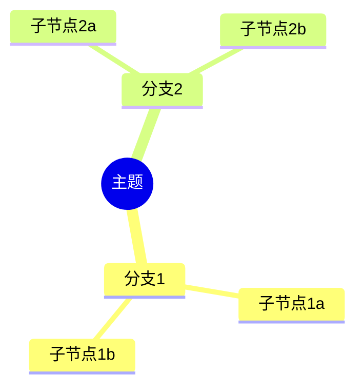

# Signal 研究模块重构设计方案 — Claude Agent SDK

> Architect: Claude Opus | 日期: 2026-02-09
> 状态: v4 (基于 Claude Agent SDK, 待 Lead 审批)
> 输入: Researcher findings.md + 用户功能确认 + Claude Agent SDK 调研
> 方向: **Claude Agent SDK + MCP In-Process Server + 最小功能集**

---

## 目录

1. [设计哲学](#1-设计哲学)
2. [后端架构](#2-后端架构)
3. [数据模型](#3-数据模型)
4. [API 端点设计](#4-api-端点设计)
5. [前端重构](#5-前端重构)
6. [关键设计决策 (ADR)](#6-关键设计决策-adr)
7. [实施路线图](#7-实施路线图)
8. [文件清单与迁移映射](#8-文件清单与迁移映射)

---

## 1. 设计哲学

### 1.1 为什么选择 Claude Agent SDK

v3 设计方案基于"自建 Agent 框架" — 手动实现 `agents/core/` 约 500 行代码（EventBus、AgentRunner、ToolRegistry、BaseAgent 等 8 个模块）。这个方案有三个根本问题:

1. **维护负担**: 自建框架意味着自己处理流中断、并发安全、工具调用边界情况、token 统计等所有 edge cases
2. **演进成本**: 每次 LLM 提供商更新 API（新的流式格式、工具调用协议），都需要手动适配
3. **功能受限**: Subagent 委派、会话恢复、模型切换等高级能力需要从零实现

Claude Agent SDK（2026 年 2 月发布）将这些问题一次性解决:
- **MCP In-Process Server**: 用 `@tool` 装饰器定义工具，SDK 自动处理工具发现、参数验证、执行编排
- **流式原生**: `ClaudeSDKClient.receive_response()` 返回 `AsyncIterator`，天然适配 FastAPI SSE
- **Subagent**: 内置 `AgentDefinition`，无需手动实现 Handoff 协议
- **会话恢复**: `resume` 参数恢复之前的会话 ID，SDK 管理上下文
- **模型灵活**: 按 Agent 配置不同模型 (Opus/Sonnet/Haiku)

**关键判断**: 用 500 行自建框架模拟 SDK 已有的能力，是错误的工程决策。

### 1.2 核心原则

| 原则 | 含义 |
|------|------|
| **SDK-First** | 不手写 Agent 循环 — Claude Agent SDK 管理工具调用、上下文、流式 |
| **MCP 工具化** | 所有自定义能力（搜索、读取、保存）通过 MCP In-Process Server 注册 |
| **流式优先** | SSE 是一等公民 — SDK `receive_response()` → FastAPI `StreamingResponse` |
| **双 LLM 共存** | 研究模块使用 Claude (Anthropic)，其他 Pipeline 继续使用 Kimi (Moonshot) |
| **最小功能集** | 5 个核心功能 x 一流实现 > 15 个功能 x mock 代码 |

### 1.3 与 v3 方案的对比

```
v3 (已否决)                         v4 (本方案)
─────────────                       ─────────────
agents/core/ 自建框架 (~500行)      → Claude Agent SDK (pip install)
EventBus 三通道事件系统              → SDK 内置流式 + FastAPI SSE
AgentRunner 手动执行循环             → ClaudeSDKClient 自动管理
ToolRegistry + BaseTool 协议         → @tool 装饰器 + MCP Server
AG-UI 16 种事件格式                 → 简化 SSE 事件 (text/tool/done/error)
KimiClient duck typing              → Anthropic API (Claude 模型)
8 个新框架文件                      → 1 个 SDK 集成层 + 工具定义
```

---

## 2. 后端架构

### 2.1 模块结构

```
backend/app/agents/research/
├── __init__.py              # 公共 API 导出
├── sdk_service.py           # Claude SDK 服务层 — 核心集成模块
├── tools.py                 # MCP 工具定义 (5 个自定义工具)
├── prompts.py               # Agent system_prompt 集中管理
└── session_store.py         # 会话持久化存储
```

对比 v3 方案需要新建 13 个文件（`agents/core/` 8 个 + `agents/research/` 5 个），v4 仅需 4 个文件。

### 2.2 MCP 工具定义

所有自定义工具通过 `@tool` 装饰器注册到 MCP In-Process Server，SDK 自动处理工具发现和参数验证。

#### `tools.py` — 完整实现

```python
"""
[INPUT]: 依赖 database, embedding_service, tavily, models/research
[OUTPUT]: 对外提供 MCP 工具注册和 Server 实例
[POS]: agents/research/ 的工具层，被 sdk_service.py 消费
[PROTOCOL]: 变更时更新此头部，然后检查 CLAUDE.md
"""

import json
import os
from typing import Optional

from claude_agent_sdk import tool, create_sdk_mcp_server
from sqlalchemy import text
from sqlalchemy.orm import Session

from app.database import SessionLocal
from app.agents.embeddings.bailian_embedding import embedding_service, TextSplitter
from app.models.research import ResearchSource, SourceEmbedding, ResearchOutput


# ============================================================
# 工具 1: 向量语义搜索
# ============================================================
@tool(
    "search_vectors",
    "在项目源材料中进行语义搜索，基于向量相似度查找最相关的文本片段。"
    "适合查找与查询语义相近的内容，即使措辞不同也能找到。"
    "优先使用此工具搜索项目内已有材料。",
    {
        "query": str,
        "project_id": str,
        "top_k": int,
    },
)
async def search_vectors(args: dict) -> dict:
    """pgvector 语义搜索 — 在项目源材料 embeddings 中查找最相关片段"""
    query = args["query"]
    project_id = args["project_id"]
    top_k = args.get("top_k", 5)

    db: Session = SessionLocal()
    try:
        # 生成查询向量
        query_embedding = await embedding_service.embed_query(query)

        # pgvector 余弦相似度搜索
        sql = text("""
            SELECT
                se.source_id,
                se.chunk_index,
                se.chunk_text,
                1 - (se.embedding <=> :query_embedding::vector) AS similarity,
                rs.title AS source_title,
                rs.source_type,
                rs.original_url
            FROM source_embeddings se
            JOIN research_sources rs ON se.source_id = rs.id
            WHERE rs.project_id = :project_id::uuid
              AND 1 - (se.embedding <=> :query_embedding::vector) >= 0.6
            ORDER BY se.embedding <=> :query_embedding::vector
            LIMIT :top_k
        """)

        result = db.execute(sql, {
            "query_embedding": str(query_embedding),
            "project_id": project_id,
            "top_k": top_k,
        })

        results = []
        for row in result:
            results.append({
                "source_id": str(row.source_id),
                "chunk_text": row.chunk_text,
                "similarity": round(float(row.similarity), 3),
                "source_title": row.source_title or "未命名",
                "source_type": row.source_type,
                "url": row.original_url or "",
            })

        formatted = _format_vector_results(query, results)
        return {"content": [{"type": "text", "text": formatted}]}

    except Exception as e:
        return {"content": [{"type": "text", "text": f"向量搜索失败: {e}"}]}
    finally:
        db.close()


def _format_vector_results(query: str, results: list) -> str:
    """格式化向量搜索结果为 LLM 可读文本"""
    if not results:
        return f"未找到与 '{query}' 相关的项目材料。"

    lines = [f"向量搜索 '{query}' 的结果 ({len(results)} 条):\n"]
    for i, r in enumerate(results, 1):
        lines.append(f"[{i}] {r['source_title']} (相似度: {r['similarity']})")
        if r["url"]:
            lines.append(f"    URL: {r['url']}")
        lines.append(f"    内容: {r['chunk_text'][:800]}")
        lines.append("")

    return "\n".join(lines)


# ============================================================
# 工具 2: 全文搜索
# ============================================================
@tool(
    "search_fulltext",
    "在项目源材料中进行全文关键词搜索。"
    "适合精确匹配特定术语、名称或短语。"
    "与 search_vectors 互补: 向量搜索找语义相近的内容，全文搜索找精确匹配。",
    {
        "query": str,
        "project_id": str,
        "limit": int,
    },
)
async def search_fulltext(args: dict) -> dict:
    """PostgreSQL tsvector 全文搜索"""
    query = args["query"]
    project_id = args["project_id"]
    limit = args.get("limit", 10)

    db: Session = SessionLocal()
    try:
        # 使用 ILIKE 进行模糊匹配（后续可升级为 tsvector）
        sql = text("""
            SELECT
                rs.id AS source_id,
                rs.title,
                rs.source_type,
                rs.original_url,
                SUBSTRING(rs.full_text FROM 1 FOR 1000) AS excerpt
            FROM research_sources rs
            WHERE rs.project_id = :project_id::uuid
              AND rs.processing_status = 'completed'
              AND (
                  rs.full_text ILIKE :pattern
                  OR rs.title ILIKE :pattern
                  OR rs.summary ILIKE :pattern
              )
            LIMIT :limit
        """)

        result = db.execute(sql, {
            "project_id": project_id,
            "pattern": f"%{query}%",
            "limit": limit,
        })

        lines = [f"全文搜索 '{query}' 的结果:\n"]
        count = 0
        for row in result:
            count += 1
            lines.append(f"[{count}] {row.title or '未命名'}")
            if row.original_url:
                lines.append(f"    URL: {row.original_url}")
            if row.excerpt:
                lines.append(f"    摘录: {row.excerpt[:500]}")
            lines.append("")

        if count == 0:
            return {"content": [{"type": "text", "text": f"未找到包含 '{query}' 的源材料。"}]}

        return {"content": [{"type": "text", "text": "\n".join(lines)}]}

    except Exception as e:
        return {"content": [{"type": "text", "text": f"全文搜索失败: {e}"}]}
    finally:
        db.close()


# ============================================================
# 工具 3: Tavily 网络搜索
# ============================================================
@tool(
    "tavily_search",
    "搜索互联网获取最新信息。"
    "当项目源材料不足以回答问题时使用。"
    "返回网页标题、URL 和内容摘要。",
    {
        "query": str,
        "max_results": int,
        "search_depth": str,
    },
)
async def tavily_search(args: dict) -> dict:
    """Tavily API 网络搜索"""
    from tavily import AsyncTavilyClient

    query = args["query"]
    max_results = args.get("max_results", 5)
    search_depth = args.get("search_depth", "basic")

    api_key = os.getenv("TAVILY_API_KEY")
    if not api_key:
        return {"content": [{"type": "text", "text": "Tavily API Key 未配置。"}]}

    try:
        client = AsyncTavilyClient(api_key=api_key)
        response = await client.search(
            query=query,
            max_results=max_results,
            search_depth=search_depth,
        )

        results = response.get("results", [])
        if not results:
            return {"content": [{"type": "text", "text": f"网络搜索 '{query}' 未找到相关结果。"}]}

        lines = [f"网络搜索 '{query}' 的结果 ({len(results)} 条):\n"]
        for i, r in enumerate(results, 1):
            lines.append(f"[{i}] {r.get('title', '无标题')}")
            lines.append(f"    URL: {r.get('url', '')}")
            lines.append(f"    {r.get('content', '')[:600]}")
            lines.append("")

        return {"content": [{"type": "text", "text": "\n".join(lines)}]}

    except Exception as e:
        return {"content": [{"type": "text", "text": f"网络搜索失败: {e}"}]}


# ============================================================
# 工具 4: 读取源材料全文
# ============================================================
@tool(
    "read_source_content",
    "读取指定源材料的完整内容。"
    "当搜索返回的片段不够详细，需要查看完整文本时使用。"
    "需要提供 source_id（从搜索结果中获取）。",
    {
        "source_id": str,
        "project_id": str,
    },
)
async def read_source_content(args: dict) -> dict:
    """读取 ResearchSource 的完整处理后内容"""
    source_id = args["source_id"]
    project_id = args["project_id"]

    db: Session = SessionLocal()
    try:
        source = (
            db.query(ResearchSource)
            .filter(
                ResearchSource.id == source_id,
                ResearchSource.project_id == project_id,
            )
            .first()
        )

        if not source:
            return {"content": [{"type": "text", "text": f"源材料 {source_id} 未找到或不属于当前项目。"}]}

        # 优先返回 full_text，其次 summary
        content = source.full_text or source.summary or "该源材料暂无内容。"

        header = f"## {source.title or '未命名'}\n"
        if source.original_url:
            header += f"URL: {source.original_url}\n"
        header += f"类型: {source.source_type} | 状态: {source.processing_status}\n\n"

        # 截断超长内容以控制上下文消耗
        max_chars = 30000
        if len(content) > max_chars:
            content = content[:max_chars] + f"\n\n... (内容已截断，总长 {len(content)} 字符)"

        return {"content": [{"type": "text", "text": header + content}]}

    except Exception as e:
        return {"content": [{"type": "text", "text": f"读取源材料失败: {e}"}]}
    finally:
        db.close()


# ============================================================
# 工具 5: 保存输出到数据库
# ============================================================
@tool(
    "save_output",
    "将生成的报告或思维导图保存到项目数据库中。"
    "报告使用 Markdown 格式，思维导图使用 Mermaid 代码。"
    "保存后用户可以在 Studio 面板的输出列表中查看。",
    {
        "project_id": str,
        "output_type": str,
        "title": str,
        "content": str,
    },
)
async def save_output(args: dict) -> dict:
    """保存 ResearchOutput 到数据库"""
    project_id = args["project_id"]
    output_type = args["output_type"]  # "report" 或 "mindmap"
    title = args["title"]
    content = args["content"]

    db: Session = SessionLocal()
    try:
        output = ResearchOutput(
            project_id=project_id,
            output_type=output_type,
            title=title,
            content=content,
            content_format="markdown" if output_type == "report" else "mermaid",
        )
        db.add(output)
        db.commit()
        db.refresh(output)

        return {"content": [{"type": "text", "text": f"已保存 {output_type}: {title} (ID: {output.id})"}]}

    except Exception as e:
        db.rollback()
        return {"content": [{"type": "text", "text": f"保存失败: {e}"}]}
    finally:
        db.close()


# ============================================================
# MCP Server 注册
# ============================================================
def create_research_mcp_server():
    """创建研究模块的 MCP In-Process Server"""
    return create_sdk_mcp_server(
        name="signal-research",
        version="1.0.0",
        tools=[
            search_vectors,
            search_fulltext,
            tavily_search,
            read_source_content,
            save_output,
        ],
    )
```

### 2.3 Agent 定义

#### `prompts.py` — System Prompt 集中管理

```python
"""
[INPUT]: 无外部依赖
[OUTPUT]: 对外提供各 Agent 的 system_prompt 和配置常量
[POS]: agents/research/ 的提示词层
[PROTOCOL]: 变更时更新此头部，然后检查 CLAUDE.md
"""


# ============================================================
# ChatAgent 提示词
# ============================================================
CHAT_SYSTEM_PROMPT = """你是一个研究助手，帮助用户基于已收集的源材料回答问题。

## 核心规则
1. 优先使用 search_vectors 工具在项目源材料中搜索相关内容
2. 如果源材料不足以回答问题，使用 tavily_search 搜索网络
3. 使用 read_source_content 读取源材料完整内容（当需要更多上下文时）
4. 使用 search_fulltext 精确匹配特定术语或名称
5. 每个回答必须基于实际的搜索结果，不要臆造信息

## 回答格式
- 使用 Markdown 格式
- 引用来源时标注 [来源标题](URL)
- 如果无法找到相关信息，明确告知用户
- 在回答末尾列出"参考来源"，格式:

### 参考来源
- [标题](URL) — 项目源材料 / 网络搜索

## 项目上下文
项目 ID: {project_id}
"""


# ============================================================
# ReportAgent 提示词
# ============================================================
REPORT_SYSTEM_PROMPT = """你是一个研究报告撰写专家。基于项目中的源材料，生成一份全面的研究报告。

## 撰写流程
1. 首先使用 search_vectors 搜索项目中所有源材料的关键内容
2. 使用 read_source_content 读取最相关的源材料全文
3. 如有需要，使用 tavily_search 补充网络资料
4. 综合所有信息，撰写结构化报告
5. 使用 save_output 工具保存报告到数据库

## 报告结构
## 摘要
(200 字以内的核心发现)

## 背景
(研究主题的背景介绍)

## 关键发现
(分点列出主要发现，每点附带来源引用)

## 分析
(深入分析关键发现之间的关联和趋势)

## 结论与建议
(基于分析的结论和行动建议)

## 参考来源
(列出所有引用的来源: 标题 + URL)

## 项目上下文
项目 ID: {project_id}
要求: 报告必须基于实际搜索结果，禁止臆造。报告完成后使用 save_output 工具保存。"""


# ============================================================
# MindmapAgent 提示词
# ============================================================
MINDMAP_SYSTEM_PROMPT = """你是一个思维导图生成专家。基于项目源材料，生成 Mermaid 格式的思维导图。

## 生成流程
1. 使用 search_vectors 搜索项目中的所有源材料
2. 使用 read_source_content 读取关键源材料的完整内容
3. 提取核心概念、主题和它们之间的关系
4. 生成 Mermaid mindmap 语法
5. 使用 save_output 工具保存思维导图到数据库

## 输出格式 (严格遵守)


## 项目上下文
项目 ID: {project_id}

## 要求
- 最多 3 层深度
- 每个分支最多 5 个子节点
- 节点文本简短 (10 字以内)
- 只输出 Mermaid 代码块，不要其他文字
- 生成完成后使用 save_output 工具保存，output_type 设为 "mindmap"
"""


# ============================================================
# 模型配置
# ============================================================
AGENT_MODEL_MAP = {
    "chat": "claude-sonnet-4-5",       # 对话: Sonnet 快速且成本合理
    "report": "claude-opus-4-6",       # 报告: Opus 深度分析能力
    "mindmap": "claude-sonnet-4-5",    # 思维导图: Sonnet 足够
}

# 工具权限配置 — 每个 Agent 允许调用的工具
AGENT_TOOL_PERMISSIONS = {
    "chat": [
        "mcp__signal_research__search_vectors",
        "mcp__signal_research__search_fulltext",
        "mcp__signal_research__tavily_search",
        "mcp__signal_research__read_source_content",
    ],
    "report": [
        "mcp__signal_research__search_vectors",
        "mcp__signal_research__search_fulltext",
        "mcp__signal_research__tavily_search",
        "mcp__signal_research__read_source_content",
        "mcp__signal_research__save_output",
    ],
    "mindmap": [
        "mcp__signal_research__search_vectors",
        "mcp__signal_research__read_source_content",
        "mcp__signal_research__save_output",
    ],
}

# 执行限制
AGENT_LIMITS = {
    "chat": {"max_turns": 10, "max_budget_usd": 0.50},
    "report": {"max_turns": 15, "max_budget_usd": 2.00},
    "mindmap": {"max_turns": 8, "max_budget_usd": 0.50},
}
```

### 2.4 SDK 服务层

#### `sdk_service.py` — 核心集成模块

```python
"""
[INPUT]: 依赖 claude_agent_sdk, tools.py, prompts.py, session_store.py
[OUTPUT]: 对外提供 ResearchSDKService 类，被 api/research.py 消费
[POS]: agents/research/ 的服务层，是 Claude Agent SDK 的唯一集成点
[PROTOCOL]: 变更时更新此头部，然后检查 CLAUDE.md
"""

import json
import os
import structlog
from typing import AsyncIterator, Optional
from dataclasses import dataclass

from claude_agent_sdk import (
    ClaudeSDKClient,
    ClaudeAgentOptions,
    AgentDefinition,
    AssistantMessage,
    TextBlock,
    ToolUseBlock,
    ToolResultBlock,
)

from .tools import create_research_mcp_server
from .prompts import (
    CHAT_SYSTEM_PROMPT,
    REPORT_SYSTEM_PROMPT,
    MINDMAP_SYSTEM_PROMPT,
    AGENT_MODEL_MAP,
    AGENT_TOOL_PERMISSIONS,
    AGENT_LIMITS,
)
from .session_store import SessionStore

logger = structlog.get_logger()


# ============================================================
# SSE 事件类型
# ============================================================
@dataclass(frozen=True)
class SSEEvent:
    """SSE 事件 — 简化版（不使用 AG-UI 16 种事件）"""
    event: str     # text / tool_start / tool_end / done / error
    data: str      # JSON 序列化数据

    def serialize(self) -> str:
        return f"event: {self.event}\ndata: {self.data}\n\n"


# ============================================================
# 研究模块 SDK 服务
# ============================================================
class ResearchSDKService:
    """
    Claude Agent SDK 集成服务

    职责:
    - 管理 MCP Server 生命周期
    - 为不同 Agent 类型构建 ClaudeAgentOptions
    - 提供流式聊天、报告生成、思维导图生成的统一接口
    - SSE 事件序列化

    使用方式:
        service = ResearchSDKService()
        async for event in service.chat_stream(project_id, message, session_id):
            yield event.serialize()
    """

    def __init__(self) -> None:
        self._mcp_server = create_research_mcp_server()
        self._session_store = SessionStore()
        self._api_key = os.getenv("ANTHROPIC_API_KEY")

        if not self._api_key:
            logger.warning("research.sdk.init.no_api_key",
                           msg="ANTHROPIC_API_KEY 未配置，研究模块不可用")

    @property
    def is_available(self) -> bool:
        """检查 SDK 服务是否可用"""
        return bool(self._api_key)

    # ============================================================
    # 流式聊天
    # ============================================================
    async def chat_stream(
        self,
        project_id: str,
        message: str,
        session_id: Optional[str] = None,
    ) -> AsyncIterator[SSEEvent]:
        """
        流式对话 — 返回 SSE 事件迭代器

        参数:
            project_id: 项目 ID
            message: 用户消息
            session_id: 会话 ID（可选，用于恢复会话）

        生成:
            SSEEvent: text / tool_start / tool_end / done / error
        """
        agent_type = "chat"
        system_prompt = CHAT_SYSTEM_PROMPT.format(project_id=project_id)

        async for event in self._run_agent_stream(
            agent_type=agent_type,
            system_prompt=system_prompt,
            user_message=message,
            project_id=project_id,
            session_id=session_id,
        ):
            yield event

    # ============================================================
    # 报告生成
    # ============================================================
    async def report_stream(
        self,
        project_id: str,
        topic: Optional[str] = None,
    ) -> AsyncIterator[SSEEvent]:
        """
        流式生成报告 — 返回 SSE 事件迭代器

        参数:
            project_id: 项目 ID
            topic: 报告主题（可选，默认综合所有源材料）
        """
        agent_type = "report"
        system_prompt = REPORT_SYSTEM_PROMPT.format(project_id=project_id)
        user_message = topic or "请综合项目中所有源材料，生成一份全面的研究报告。"

        async for event in self._run_agent_stream(
            agent_type=agent_type,
            system_prompt=system_prompt,
            user_message=user_message,
            project_id=project_id,
        ):
            yield event

    # ============================================================
    # 思维导图生成
    # ============================================================
    async def mindmap_stream(
        self,
        project_id: str,
        focus: Optional[str] = None,
    ) -> AsyncIterator[SSEEvent]:
        """
        流式生成思维导图 — 返回 SSE 事件迭代器

        参数:
            project_id: 项目 ID
            focus: 聚焦主题（可选）
        """
        agent_type = "mindmap"
        system_prompt = MINDMAP_SYSTEM_PROMPT.format(project_id=project_id)
        user_message = focus or "请分析项目中所有源材料，生成一个思维导图。"

        async for event in self._run_agent_stream(
            agent_type=agent_type,
            system_prompt=system_prompt,
            user_message=user_message,
            project_id=project_id,
        ):
            yield event

    # ============================================================
    # 内部: Agent 流式执行
    # ============================================================
    async def _run_agent_stream(
        self,
        agent_type: str,
        system_prompt: str,
        user_message: str,
        project_id: str,
        session_id: Optional[str] = None,
    ) -> AsyncIterator[SSEEvent]:
        """
        统一的 Agent 流式执行引擎

        流程:
        1. 构建 ClaudeAgentOptions（模型、工具权限、限制）
        2. 创建 ClaudeSDKClient 会话
        3. 发送用户消息
        4. 遍历响应流，解析 TextBlock / ToolUseBlock / ToolResultBlock
        5. 生成 SSE 事件
        6. 保存会话 ID 用于后续恢复
        """
        model = AGENT_MODEL_MAP[agent_type]
        allowed_tools = AGENT_TOOL_PERMISSIONS[agent_type]
        limits = AGENT_LIMITS[agent_type]

        options = ClaudeAgentOptions(
            model=model,
            system_prompt=system_prompt,
            permission_mode="bypassPermissions",
            max_turns=limits["max_turns"],
            max_budget_usd=limits["max_budget_usd"],
            mcp_servers={"signal_research": self._mcp_server},
            allowed_tools=allowed_tools,
        )

        # 如果有会话 ID，尝试恢复
        if session_id:
            options.resume = session_id

        references = []  # 收集引用来源

        try:
            async with ClaudeSDKClient(options=options) as client:
                await client.query(user_message)

                async for msg in client.receive_response():
                    if isinstance(msg, AssistantMessage):
                        for block in msg.content:
                            # 文本流
                            if isinstance(block, TextBlock):
                                yield SSEEvent(
                                    event="text",
                                    data=json.dumps(
                                        {"delta": block.text},
                                        ensure_ascii=False,
                                    ),
                                )

                            # 工具调用开始
                            elif isinstance(block, ToolUseBlock):
                                yield SSEEvent(
                                    event="tool_start",
                                    data=json.dumps(
                                        {
                                            "tool": block.name,
                                            "input": block.input,
                                        },
                                        ensure_ascii=False,
                                    ),
                                )

                            # 工具调用结果
                            elif isinstance(block, ToolResultBlock):
                                # 从搜索结果中提取引用来源
                                refs = _extract_references(block)
                                references.extend(refs)

                                yield SSEEvent(
                                    event="tool_end",
                                    data=json.dumps(
                                        {
                                            "tool": block.tool_name,
                                            "success": not block.is_error,
                                            "references": refs,
                                        },
                                        ensure_ascii=False,
                                    ),
                                )

                # 保存会话 ID
                new_session_id = getattr(client, "session_id", None)
                if new_session_id and agent_type == "chat":
                    await self._session_store.save(
                        project_id=project_id,
                        session_id=new_session_id,
                    )

            # 完成事件
            yield SSEEvent(
                event="done",
                data=json.dumps(
                    {
                        "session_id": new_session_id,
                        "references": references,
                    },
                    ensure_ascii=False,
                ),
            )

        except Exception as e:
            logger.error("research.agent.stream.failed",
                         agent_type=agent_type, error=str(e))
            yield SSEEvent(
                event="error",
                data=json.dumps(
                    {"error": str(e)},
                    ensure_ascii=False,
                ),
            )


def _extract_references(block) -> list[dict]:
    """从工具调用结果中提取引用来源信息"""
    refs = []
    try:
        content = block.content if hasattr(block, "content") else ""
        if isinstance(content, list):
            for item in content:
                text = item.get("text", "") if isinstance(item, dict) else str(item)
                # 解析搜索结果中的来源信息
                # 格式: [N] 标题\n    URL: xxx
                import re
                matches = re.findall(
                    r'\[(\d+)\]\s+(.+?)\n\s+URL:\s+(\S+)',
                    text,
                )
                for _, title, url in matches:
                    if url and url != "":
                        refs.append({"title": title.strip(), "url": url.strip()})
    except Exception:
        pass
    return refs


# ============================================================
# 全局单例
# ============================================================
research_sdk_service = ResearchSDKService()
```

### 2.5 会话管理

#### `session_store.py` — 会话持久化

```python
"""
[INPUT]: 依赖 database, models/research
[OUTPUT]: 对外提供 SessionStore 类，管理 Claude SDK 会话 ID 持久化
[POS]: agents/research/ 的会话存储层
[PROTOCOL]: 变更时更新此头部，然后检查 CLAUDE.md
"""

import structlog
from typing import Optional

from app.database import SessionLocal
from app.models.research import ChatSession

logger = structlog.get_logger()


class SessionStore:
    """
    Claude Agent SDK 会话 ID 持久化

    策略:
    - 每个项目一个会话（单会话模型）
    - 会话 ID 存储在 ChatSession.extra_metadata["sdk_session_id"] 中
    - 复用现有 ChatSession 表，不新建表
    """

    async def get_session_id(self, project_id: str) -> Optional[str]:
        """获取项目的 SDK 会话 ID"""
        db = SessionLocal()
        try:
            session = (
                db.query(ChatSession)
                .filter(ChatSession.project_id == project_id)
                .order_by(ChatSession.updated_at.desc())
                .first()
            )
            if session and session.messages:
                # 从 messages JSON 中的最后一条消息获取 session_id
                metadata = session.messages[-1].get("metadata", {}) if session.messages else {}
                return metadata.get("sdk_session_id")
            return None
        except Exception as e:
            logger.error("session_store.get.failed", project_id=project_id, error=str(e))
            return None
        finally:
            db.close()

    async def save(self, project_id: str, session_id: str) -> None:
        """保存 SDK 会话 ID 到项目"""
        db = SessionLocal()
        try:
            session = (
                db.query(ChatSession)
                .filter(ChatSession.project_id == project_id)
                .order_by(ChatSession.updated_at.desc())
                .first()
            )
            if not session:
                session = ChatSession(
                    project_id=project_id,
                    title="研究对话",
                    messages=[],
                )
                db.add(session)

            # 在 messages 末尾追加 session_id 元数据
            messages = session.messages or []
            # 更新最后一条消息的元数据，或追加新元数据条目
            metadata_entry = {
                "role": "system",
                "content": "",
                "metadata": {"sdk_session_id": session_id},
            }
            # 查找并更新已有的 metadata 条目
            updated = False
            for msg in messages:
                if msg.get("role") == "system" and "sdk_session_id" in msg.get("metadata", {}):
                    msg["metadata"]["sdk_session_id"] = session_id
                    updated = True
                    break
            if not updated:
                messages.append(metadata_entry)

            session.messages = messages
            db.commit()
            logger.info("session_store.saved", project_id=project_id, session_id=session_id)
        except Exception as e:
            logger.error("session_store.save.failed", project_id=project_id, error=str(e))
            db.rollback()
        finally:
            db.close()
```

### 2.6 SSE 流式数据流

完整的数据流路径:

```
Frontend (fetch + EventSource)
    ↓ POST /api/research/projects/{id}/chat
    ↓ body: { message: "..." }

FastAPI API Layer (api/research.py)
    ↓ 调用 research_sdk_service.chat_stream(project_id, message, session_id)
    ↓ 返回 StreamingResponse(event_generator(), media_type="text/event-stream")

ResearchSDKService (sdk_service.py)
    ↓ 构建 ClaudeAgentOptions (model, tools, limits)
    ↓ 创建 ClaudeSDKClient
    ↓ client.query(message)
    ↓ async for msg in client.receive_response():

Claude Agent SDK (claude-agent-sdk)
    ↓ 调用 Anthropic API (Claude Sonnet/Opus)
    ↓ 解析工具调用 → 执行 MCP 工具 → 回注结果
    ↓ 返回 AssistantMessage (TextBlock / ToolUseBlock / ToolResultBlock)

MCP In-Process Server (tools.py)
    ↓ search_vectors → pgvector + Bailian embedding
    ↓ search_fulltext → PostgreSQL ILIKE
    ↓ tavily_search → Tavily API
    ↓ read_source_content → DB query
    ↓ save_output → DB insert

SSE 事件序列 (从 SDK 服务到前端):
    event: tool_start   data: {"tool": "search_vectors", "input": {...}}
    event: tool_end     data: {"tool": "search_vectors", "success": true, "references": [...]}
    event: text         data: {"delta": "根据搜索结果，"}
    event: text         data: {"delta": "主要发现如下..."}
    event: tool_start   data: {"tool": "tavily_search", "input": {...}}
    event: tool_end     data: {"tool": "tavily_search", "success": true, "references": [...]}
    event: text         data: {"delta": "\n\n### 参考来源\n..."}
    event: done         data: {"session_id": "...", "references": [...]}
```

### 2.7 降级路径

Claude Agent SDK 当前为 Alpha 状态。如果 SDK 出现严重问题，降级策略:

1. **SDK API 不稳定**: `sdk_service.py` 是唯一的 SDK 集成点。可以替换内部实现为直接调用 Anthropic Messages API (`anthropic` Python SDK)，保持对外 SSE 事件格式不变
2. **Anthropic API 不可用**: 在 `sdk_service.py` 中添加 fallback 到 KimiClient，复用现有 `agents/research/agent.py` 的 ResearchAgent 逻辑
3. **MCP Server 问题**: 工具可以直接注册为 Anthropic Messages API 的 tool definitions，不依赖 MCP

```python
# 降级示例 — 在 sdk_service.py 中
class ResearchSDKService:
    async def chat_stream(self, ...):
        if not self.is_available:
            # 降级到 Kimi
            async for event in self._fallback_kimi_chat(project_id, message):
                yield event
            return
        # 正常 SDK 路径...
```

---

## 3. 数据模型

### 3.1 现有模型保留（不变）

以下表结构不需要任何变更:

- `research_projects` — 项目表
- `research_sources` — 源材料表
- `source_embeddings` — 向量嵌入表
- `research_outputs` — 输出表（报告/思维导图）

### 3.2 ChatSession 表变更

当前 `chat_sessions` 表存储多会话，且消息嵌套在 JSONB 的 `messages` 字段中。重构为单会话模型后:

```sql
-- 不新增表，复用 chat_sessions
-- 每个项目只保留一个活跃会话
-- messages JSONB 中追加 sdk_session_id 元数据

-- 无 DDL 变更需要
```

### 3.3 新增 ChatMessage 表

将消息从 ChatSession.messages JSONB 提升为独立表，支持星标消息和引用来源:

```sql
CREATE TABLE IF NOT EXISTS chat_messages (
    id UUID PRIMARY KEY DEFAULT gen_random_uuid(),
    project_id UUID NOT NULL REFERENCES research_projects(id) ON DELETE CASCADE,
    role VARCHAR(20) NOT NULL,          -- 'user' | 'assistant'
    content TEXT NOT NULL,
    starred BOOLEAN DEFAULT FALSE,       -- 星标消息
    references JSONB DEFAULT '[]',       -- 引用来源列表
    -- references 格式: [{"title": "...", "url": "...", "type": "source|web"}]
    created_at TIMESTAMPTZ DEFAULT NOW(),

    -- 索引
    CONSTRAINT idx_chatmsg_project FOREIGN KEY (project_id)
        REFERENCES research_projects(id) ON DELETE CASCADE
);

CREATE INDEX idx_chatmsg_project_id ON chat_messages(project_id);
CREATE INDEX idx_chatmsg_starred ON chat_messages(project_id, starred) WHERE starred = TRUE;
CREATE INDEX idx_chatmsg_created ON chat_messages(created_at DESC);
```

### 3.4 ORM 模型更新

```python
# models/research.py 新增

class ChatMessage(Base):
    """
    对话消息表 — 独立存储每条消息

    取代 ChatSession.messages JSONB 嵌套存储。
    支持星标消息和引用来源。
    """
    __tablename__ = "chat_messages"

    id = Column(UUID(as_uuid=True), primary_key=True, default=uuid.uuid4)
    project_id = Column(
        UUID(as_uuid=True),
        ForeignKey("research_projects.id", ondelete="CASCADE"),
        nullable=False,
    )
    role = Column(String(20), nullable=False)     # user / assistant
    content = Column(Text, nullable=False)
    starred = Column(Boolean, default=False)
    references = Column(JSONB, default=list)

    created_at = Column(DateTime(timezone=True), server_default=func.now())

    # 关系
    project = relationship("ResearchProject", backref="chat_messages")

    __table_args__ = (
        Index("idx_chatmsg_project_id", "project_id"),
        Index("idx_chatmsg_created", "created_at", postgresql_using="btree"),
    )
```

### 3.5 Claude 会话历史存储策略

| 方案 | 描述 | 选择 |
|------|------|------|
| SDK Session Resume | 使用 `ClaudeAgentOptions.resume` 恢复会话，SDK 管理上下文 | 主方案 |
| DB 完整历史 | 每条消息存到 chat_messages 表 | 辅助（用于 UI 展示） |
| ChatSession JSONB | 旧方案，消息嵌套在 JSON 中 | 废弃 |

**方案**: 双写。SDK Session ID 用于恢复 Claude 上下文（Agent 记忆），chat_messages 表用于前端历史消息展示和星标功能。两者独立，互不依赖。

---

## 4. API 端点设计

### 4.1 端点列表

```
# 项目管理 (不变)
POST   /api/research/projects                              → 创建项目
GET    /api/research/projects                              → 项目列表
GET    /api/research/projects/{id}                         → 项目详情
DELETE /api/research/projects/{id}                         → 删除项目

# 源材料 (小幅修改)
POST   /api/research/projects/{id}/sources                 → 添加源材料 (URL/文本)
POST   /api/research/projects/{id}/sources/upload          → 上传文件 (PDF)
GET    /api/research/projects/{id}/sources                 → 源材料列表 (含处理状态)
DELETE /api/research/sources/{source_id}                   → 删除源材料

# 对话 (重写 — Claude Agent SDK 驱动)
POST   /api/research/projects/{id}/chat                    → SSE 流式对话 ★
GET    /api/research/projects/{id}/chat/messages            → 历史消息列表
POST   /api/research/projects/{id}/messages/{msg_id}/star  → 星标/取消星标

# Studio 生成 (重写 — Claude Agent SDK 驱动)
POST   /api/research/projects/{id}/generate/report         → SSE 流式生成报告 ★
POST   /api/research/projects/{id}/generate/mindmap        → SSE 流式生成思维导图 ★

# 输出 (不变)
GET    /api/research/projects/{id}/outputs                 → 输出列表
GET    /api/research/outputs/{output_id}                   → 输出详情
DELETE /api/research/outputs/{output_id}                   → 删除输出
```

### 4.2 SSE 事件格式定义

所有流式端点返回 `text/event-stream`，使用以下 5 种事件类型:

| 事件 | data 格式 | 含义 |
|------|-----------|------|
| `text` | `{"delta": "文本片段"}` | AI 正在输出文本 |
| `tool_start` | `{"tool": "search_vectors", "input": {...}}` | 开始调用工具 |
| `tool_end` | `{"tool": "search_vectors", "success": true, "references": [...]}` | 工具调用完成 |
| `done` | `{"session_id": "...", "references": [...]}` | 流式完成 |
| `error` | `{"error": "错误信息"}` | 发生错误 |

**与 v3 AG-UI 16 种事件的对比**: v3 方案使用完整的 AG-UI 协议（RUN_STARTED / STEP_STARTED / TEXT_MESSAGE_START / TEXT_MESSAGE_CONTENT / TEXT_MESSAGE_END / TOOL_CALL_START / TOOL_CALL_ARGS / TOOL_CALL_END / STATE_SNAPSHOT 等 16 种事件），过度设计。实际前端只需要 5 种事件即可覆盖所有 UI 状态。

### 4.3 核心端点实现

```python
# api/research.py — 对话和生成端点 (重写部分)

from fastapi import APIRouter, Depends, HTTPException
from fastapi.responses import StreamingResponse
from pydantic import BaseModel, Field
from typing import Optional
from uuid import UUID

from app.database import get_db
from app.models.research import ResearchProject, ChatMessage
from app.agents.research.sdk_service import research_sdk_service

router = APIRouter(prefix="/research", tags=["研究助手"])


# ============================================================
# 流式对话
# ============================================================
class ChatStreamRequest(BaseModel):
    message: str = Field(..., min_length=1, max_length=5000)


@router.post("/projects/{project_id}/chat")
async def chat_stream(
    project_id: UUID,
    request: ChatStreamRequest,
    db=Depends(get_db),
):
    """
    流式对话端点 — 返回 SSE 事件流

    数据流:
    ChatStreamRequest
      → ResearchSDKService.chat_stream()
      → ClaudeSDKClient (Claude Agent SDK)
      → MCP 工具执行 (search_vectors, tavily_search, ...)
      → SSE StreamingResponse
    """
    # 验证项目存在
    project = db.query(ResearchProject).filter(
        ResearchProject.id == project_id,
    ).first()
    if not project:
        raise HTTPException(status_code=404, detail="Project not found")

    # 检查 SDK 可用性
    if not research_sdk_service.is_available:
        raise HTTPException(status_code=503, detail="研究服务不可用，请检查 ANTHROPIC_API_KEY 配置")

    # 保存用户消息到数据库
    user_msg = ChatMessage(
        project_id=project_id,
        role="user",
        content=request.message,
    )
    db.add(user_msg)
    db.commit()

    # 获取会话 ID（用于恢复上下文）
    session_id = await research_sdk_service._session_store.get_session_id(
        str(project_id),
    )

    async def event_generator():
        full_content = ""
        all_references = []

        async for event in research_sdk_service.chat_stream(
            project_id=str(project_id),
            message=request.message,
            session_id=session_id,
        ):
            # 收集完整回复内容
            if event.event == "text":
                import json as _json
                delta = _json.loads(event.data).get("delta", "")
                full_content += delta

            elif event.event == "done":
                import json as _json
                done_data = _json.loads(event.data)
                all_references = done_data.get("references", [])

                # 保存 AI 回复到数据库
                ai_msg = ChatMessage(
                    project_id=project_id,
                    role="assistant",
                    content=full_content,
                    references=all_references,
                )
                db.add(ai_msg)
                db.commit()

            yield event.serialize()

    return StreamingResponse(
        event_generator(),
        media_type="text/event-stream",
        headers={
            "Cache-Control": "no-cache",
            "Connection": "keep-alive",
            "X-Accel-Buffering": "no",
        },
    )


# ============================================================
# 历史消息
# ============================================================
@router.get("/projects/{project_id}/chat/messages")
async def list_chat_messages(
    project_id: UUID,
    limit: int = 50,
    db=Depends(get_db),
):
    """获取项目的对话历史"""
    messages = (
        db.query(ChatMessage)
        .filter(ChatMessage.project_id == project_id)
        .order_by(ChatMessage.created_at.asc())
        .limit(limit)
        .all()
    )
    return [
        {
            "id": str(m.id),
            "role": m.role,
            "content": m.content,
            "starred": m.starred,
            "references": m.references or [],
            "created_at": m.created_at.isoformat() if m.created_at else None,
        }
        for m in messages
    ]


# ============================================================
# 星标消息
# ============================================================
@router.post("/projects/{project_id}/messages/{message_id}/star")
async def toggle_star_message(
    project_id: UUID,
    message_id: UUID,
    db=Depends(get_db),
):
    """切换消息星标状态"""
    msg = db.query(ChatMessage).filter(
        ChatMessage.id == message_id,
        ChatMessage.project_id == project_id,
    ).first()

    if not msg:
        raise HTTPException(status_code=404, detail="Message not found")

    msg.starred = not msg.starred
    db.commit()

    return {"id": str(msg.id), "starred": msg.starred}


# ============================================================
# 报告生成
# ============================================================
class GenerateRequest(BaseModel):
    topic: Optional[str] = None


@router.post("/projects/{project_id}/generate/report")
async def generate_report(
    project_id: UUID,
    request: GenerateRequest,
    db=Depends(get_db),
):
    """流式生成研究报告 — 返回 SSE 事件流"""
    project = db.query(ResearchProject).filter(
        ResearchProject.id == project_id,
    ).first()
    if not project:
        raise HTTPException(status_code=404, detail="Project not found")

    if not research_sdk_service.is_available:
        raise HTTPException(status_code=503, detail="研究服务不可用")

    async def event_generator():
        async for event in research_sdk_service.report_stream(
            project_id=str(project_id),
            topic=request.topic,
        ):
            yield event.serialize()

    return StreamingResponse(
        event_generator(),
        media_type="text/event-stream",
        headers={
            "Cache-Control": "no-cache",
            "Connection": "keep-alive",
            "X-Accel-Buffering": "no",
        },
    )


# ============================================================
# 思维导图生成
# ============================================================
@router.post("/projects/{project_id}/generate/mindmap")
async def generate_mindmap(
    project_id: UUID,
    request: GenerateRequest,
    db=Depends(get_db),
):
    """流式生成思维导图 — 返回 SSE 事件流"""
    project = db.query(ResearchProject).filter(
        ResearchProject.id == project_id,
    ).first()
    if not project:
        raise HTTPException(status_code=404, detail="Project not found")

    if not research_sdk_service.is_available:
        raise HTTPException(status_code=503, detail="研究服务不可用")

    async def event_generator():
        async for event in research_sdk_service.mindmap_stream(
            project_id=str(project_id),
            focus=request.topic,
        ):
            yield event.serialize()

    return StreamingResponse(
        event_generator(),
        media_type="text/event-stream",
        headers={
            "Cache-Control": "no-cache",
            "Connection": "keep-alive",
            "X-Accel-Buffering": "no",
        },
    )
```

---

## 5. 前端重构

### 5.1 React Context 架构

使用 React Context 管理研究工作台的全局状态，替代当前 workspace.tsx 中通过 props 层层传递的方式。

```typescript
// contexts/ResearchContext.tsx

'use client'

import { createContext, useContext, useReducer, useCallback, ReactNode } from 'react'

// ============================================================
// 类型定义
// ============================================================

interface Source {
  id: string
  project_id: string
  source_type: 'url' | 'pdf' | 'text'
  title: string | null
  original_url: string | null
  processing_status: 'pending' | 'processing' | 'completed' | 'failed'
  created_at: string
}

interface ChatMessage {
  id: string
  role: 'user' | 'assistant'
  content: string
  starred: boolean
  references: Array<{ title: string; url: string; type: string }>
  created_at: string
}

interface Output {
  id: string
  output_type: string
  title: string
  content?: string
  created_at: string
}

interface ResearchState {
  // 项目
  projectId: string
  projectName: string
  // 源材料
  sources: Source[]
  sourcesLoading: boolean
  // 对话
  messages: ChatMessage[]
  isStreaming: boolean
  streamingContent: string
  activeToolCalls: Array<{ tool: string; status: 'running' | 'done' }>
  // Studio
  outputs: Output[]
  isGenerating: boolean
  generatingType: string | null
}

// ============================================================
// Actions
// ============================================================

type ResearchAction =
  | { type: 'SET_SOURCES'; payload: Source[] }
  | { type: 'ADD_SOURCE'; payload: Source }
  | { type: 'REMOVE_SOURCE'; payload: string }
  | { type: 'UPDATE_SOURCE_STATUS'; payload: { id: string; status: string } }
  | { type: 'SET_MESSAGES'; payload: ChatMessage[] }
  | { type: 'ADD_MESSAGE'; payload: ChatMessage }
  | { type: 'TOGGLE_STAR'; payload: string }
  | { type: 'SET_STREAMING'; payload: boolean }
  | { type: 'APPEND_STREAMING_CONTENT'; payload: string }
  | { type: 'RESET_STREAMING_CONTENT' }
  | { type: 'ADD_TOOL_CALL'; payload: { tool: string } }
  | { type: 'FINISH_TOOL_CALL'; payload: { tool: string } }
  | { type: 'CLEAR_TOOL_CALLS' }
  | { type: 'SET_OUTPUTS'; payload: Output[] }
  | { type: 'SET_GENERATING'; payload: { type: string | null } }

// ============================================================
// Reducer
// ============================================================

function researchReducer(state: ResearchState, action: ResearchAction): ResearchState {
  switch (action.type) {
    case 'SET_SOURCES':
      return { ...state, sources: action.payload, sourcesLoading: false }
    case 'ADD_SOURCE':
      return { ...state, sources: [action.payload, ...state.sources] }
    case 'REMOVE_SOURCE':
      return { ...state, sources: state.sources.filter(s => s.id !== action.payload) }
    case 'UPDATE_SOURCE_STATUS':
      return {
        ...state,
        sources: state.sources.map(s =>
          s.id === action.payload.id
            ? { ...s, processing_status: action.payload.status as Source['processing_status'] }
            : s
        ),
      }
    case 'SET_MESSAGES':
      return { ...state, messages: action.payload }
    case 'ADD_MESSAGE':
      return { ...state, messages: [...state.messages, action.payload] }
    case 'TOGGLE_STAR':
      return {
        ...state,
        messages: state.messages.map(m =>
          m.id === action.payload ? { ...m, starred: !m.starred } : m
        ),
      }
    case 'SET_STREAMING':
      return { ...state, isStreaming: action.payload }
    case 'APPEND_STREAMING_CONTENT':
      return { ...state, streamingContent: state.streamingContent + action.payload }
    case 'RESET_STREAMING_CONTENT':
      return { ...state, streamingContent: '', activeToolCalls: [] }
    case 'ADD_TOOL_CALL':
      return {
        ...state,
        activeToolCalls: [...state.activeToolCalls, { tool: action.payload.tool, status: 'running' }],
      }
    case 'FINISH_TOOL_CALL':
      return {
        ...state,
        activeToolCalls: state.activeToolCalls.map(tc =>
          tc.tool === action.payload.tool ? { ...tc, status: 'done' } : tc
        ),
      }
    case 'CLEAR_TOOL_CALLS':
      return { ...state, activeToolCalls: [] }
    case 'SET_OUTPUTS':
      return { ...state, outputs: action.payload }
    case 'SET_GENERATING':
      return {
        ...state,
        isGenerating: action.payload.type !== null,
        generatingType: action.payload.type,
      }
    default:
      return state
  }
}

// ============================================================
// Context
// ============================================================

interface ResearchContextValue {
  state: ResearchState
  dispatch: React.Dispatch<ResearchAction>
}

const ResearchContext = createContext<ResearchContextValue | null>(null)

export function ResearchProvider({
  children,
  projectId,
  projectName,
}: {
  children: ReactNode
  projectId: string
  projectName: string
}) {
  const initialState: ResearchState = {
    projectId,
    projectName,
    sources: [],
    sourcesLoading: true,
    messages: [],
    isStreaming: false,
    streamingContent: '',
    activeToolCalls: [],
    outputs: [],
    isGenerating: false,
    generatingType: null,
  }

  const [state, dispatch] = useReducer(researchReducer, initialState)

  return (
    <ResearchContext.Provider value={{ state, dispatch }}>
      {children}
    </ResearchContext.Provider>
  )
}

export function useResearchContext() {
  const context = useContext(ResearchContext)
  if (!context) {
    throw new Error('useResearchContext must be used within ResearchProvider')
  }
  return context
}
```

### 5.2 useSSE Hook

```typescript
// hooks/useSSE.ts — SSE 消费层

import { useCallback, useRef } from 'react'

interface SSEEvent {
  event: string
  data: string
}

interface UseSSEOptions {
  onText?: (delta: string) => void
  onToolStart?: (tool: string, input: Record<string, unknown>) => void
  onToolEnd?: (tool: string, success: boolean, references: Array<{ title: string; url: string }>) => void
  onDone?: (sessionId: string | null, references: Array<{ title: string; url: string }>) => void
  onError?: (error: string) => void
}

export function useSSE() {
  const abortControllerRef = useRef<AbortController | null>(null)

  const startStream = useCallback(async (
    url: string,
    body: Record<string, unknown>,
    options: UseSSEOptions,
  ) => {
    // 取消正在进行的流
    abortControllerRef.current?.abort()
    const controller = new AbortController()
    abortControllerRef.current = controller

    try {
      const response = await fetch(url, {
        method: 'POST',
        headers: { 'Content-Type': 'application/json' },
        body: JSON.stringify(body),
        signal: controller.signal,
      })

      if (!response.ok) {
        const errorText = await response.text()
        options.onError?.(errorText || `HTTP ${response.status}`)
        return
      }

      const reader = response.body!.getReader()
      const decoder = new TextDecoder()
      let buffer = ''

      while (true) {
        const { done, value } = await reader.read()
        if (done) break

        buffer += decoder.decode(value, { stream: true })
        const lines = buffer.split('\n')
        buffer = lines.pop() || ''

        let currentEvent = ''
        for (const line of lines) {
          if (line.startsWith('event: ')) {
            currentEvent = line.slice(7).trim()
          } else if (line.startsWith('data: ')) {
            const data = line.slice(6)
            try {
              const parsed = JSON.parse(data)

              switch (currentEvent) {
                case 'text':
                  options.onText?.(parsed.delta)
                  break
                case 'tool_start':
                  options.onToolStart?.(parsed.tool, parsed.input)
                  break
                case 'tool_end':
                  options.onToolEnd?.(parsed.tool, parsed.success, parsed.references || [])
                  break
                case 'done':
                  options.onDone?.(parsed.session_id, parsed.references || [])
                  break
                case 'error':
                  options.onError?.(parsed.error)
                  break
              }
            } catch {
              // 忽略 JSON 解析错误
            }
            currentEvent = ''
          }
        }
      }
    } catch (err) {
      if (err instanceof Error && err.name !== 'AbortError') {
        options.onError?.(err.message)
      }
    }
  }, [])

  const stopStream = useCallback(() => {
    abortControllerRef.current?.abort()
    abortControllerRef.current = null
  }, [])

  return { startStream, stopStream }
}
```

### 5.3 ChatPanel 重写要点

| 变更项 | 当前状态 | 重写后 |
|--------|---------|--------|
| 输入框 | `<input>` 单行 | `<textarea>` 多行，Enter 发送 / Shift+Enter 换行 |
| 消息发送 | POST 等完整响应 | SSE 流式，实时渲染 |
| AI 回复渲染 | 纯文本 `whitespace-pre-wrap` | Markdown 渲染（react-markdown + remark-gfm） |
| 引用列表 | 无 | 消息末尾展示参考来源列表 |
| 工具状态 | 无 | 显示"正在搜索项目材料..."、"正在搜索网络..."等 |
| 星标按钮 | "保存到笔记"（无功能） | 星标切换（POST toggle API） |
| 操作按钮 | 保存/复制/点赞（大部分无功能） | 星标 + 复制（仅保留有用的） |
| 消息持久化 | 仅在 React state 中 | 后端存储 + 页面加载时获取历史 |

### 5.4 SourcesPanel 重写要点

| 变更项 | 当前状态 | 重写后 |
|--------|---------|--------|
| 文件上传 | 无 UI（后端已支持） | 新增 PDF 上传按钮 |
| 处理状态 | 一直显示 pending | 5 秒间隔轮询，状态实时更新 |
| 来源选择 | 复选框选择 | 移除（始终使用所有源材料） |
| Web/Fast Research 按钮 | 已渲染但无功能 | 移除（简化） |
| 全选复选框 | 存在 | 移除（无需选择） |

### 5.5 StudioPanel 重写要点

| 变更项 | 当前状态 | 重写后 |
|--------|---------|--------|
| 工具网格 | 4 个工具（思维导图/报告/演示文稿/音频） | 2 个工具（报告 + 思维导图） |
| 工具执行 | Mock（setTimeout 2 秒） | SSE 流式（调用 `/generate/report` 或 `/generate/mindmap`） |
| Deep Research | 独立输入框 | 合并到报告生成 |
| 笔记区 | 硬编码示例笔记 | 替换为星标消息列表 |
| 输出列表 | dangerouslySetInnerHTML | Markdown 渲染 |

---

## 6. 关键设计决策 (ADR)

### ADR-1: Claude Agent SDK vs 自建框架 vs Deep Agents

| 项目 | 内容 |
|------|------|
| **背景** | v3 方案选择自建 `agents/core/` 框架 (~500 行 7 个模块)。用户否决，要求使用 Claude Agent SDK |
| **决策** | 使用 Claude Agent SDK (`pip install claude-agent-sdk`)，不自建框架 |
| **理由** | (1) SDK 内置工具调用循环、流式输出、会话恢复，无需手动实现 (2) MCP In-Process Server 提供标准化工具注册 (3) 减少约 500 行自建代码的维护负担 (4) Subagent、Hooks 等高级能力开箱可用 (5) 自建框架在流中断、并发安全、token 统计等 edge cases 上风险高 |
| **风险** | SDK 为 Alpha 状态，API 可能变更 |
| **缓解** | `sdk_service.py` 是唯一集成点，内部实现可替换为直接调用 Anthropic Messages API |

### ADR-2: MCP In-Process Server vs External Server

| 项目 | 内容 |
|------|------|
| **背景** | MCP 支持 In-Process（同进程）和 External（独立进程/HTTP）两种模式 |
| **决策** | 使用 In-Process Server — 工具代码与 FastAPI 应用在同一进程中运行 |
| **理由** | (1) 工具需要直接访问 SQLAlchemy Session 和 pgvector — In-Process 零序列化开销 (2) 单实例部署，无需进程间通信 (3) 部署简单，不增加额外容器 |
| **升级条件** | 如果工具执行需要隔离（安全沙箱）或多服务共享，可迁移到 External Server |

### ADR-3: 会话持久化策略

| 项目 | 内容 |
|------|------|
| **背景** | 需要在页面刷新后恢复 Claude 对话上下文 |
| **决策** | 双写: SDK Session ID 存储在 DB 用于 `ClaudeAgentOptions.resume`，同时每条消息独立存储在 `chat_messages` 表 |
| **理由** | (1) SDK Resume 恢复 Claude 内部上下文（工具调用历史等），这是 DB 无法替代的 (2) `chat_messages` 表支持星标、引用列表等前端功能 (3) 两者解耦 — SDK Session 失效时仍可展示历史消息 |
| **替代方案** | 仅用 DB 存储消息，每次重新构建 Claude 上下文 — 缺点: token 浪费大，且工具调用历史无法完美重建 |

### ADR-4: 模型选择策略

| 项目 | 内容 |
|------|------|
| **背景** | 不同任务对 LLM 能力和成本的需求不同 |
| **决策** | Chat = Sonnet 4.5, Report = Opus 4.6, Mindmap = Sonnet 4.5 |
| **理由** | (1) Chat 需要快速响应，Sonnet 延迟更低 (2) Report 需要深度分析和长文本生成，Opus 推理能力更强 (3) Mindmap 是结构化输出，Sonnet 足够 (4) 成本控制: Sonnet 单价约为 Opus 的 1/5 |
| **配置位置** | `prompts.py` 的 `AGENT_MODEL_MAP`，可随时调整 |

### ADR-5: Kimi vs Claude 共存策略

| 项目 | 内容 |
|------|------|
| **背景** | 项目已有大量基于 Kimi (Moonshot) 的 Pipeline 代码 |
| **决策** | 研究模块使用 Claude (Anthropic API Key)，其他 Pipeline (article/twitter/podcast/video) 继续使用 Kimi |
| **理由** | (1) 研究模块需要工具调用能力和长上下文窗口，Claude 表现更优 (2) Pipeline 已稳定运行，无需迁移 (3) 双 API Key 共存无技术冲突 |
| **影响** | 新增 `ANTHROPIC_API_KEY` 环境变量，现有 `MOONSHOT_API_KEY` 不变 |
| **隔离** | 研究模块代码路径: `agents/research/sdk_service.py` → Claude Agent SDK → Anthropic API。Pipeline 代码路径: `agents/llm/kimi_client.py` → Moonshot API。两条路径完全独立 |

---

## 7. 实施路线图

### Phase 1: 后端 Agent 层 + MCP 工具 (~6 个文件)

**目标**: 建立 Claude Agent SDK 集成层 + MCP 工具 + 新 API 端点

| # | 任务 | 文件 | 依赖 |
|---|------|------|------|
| 1.1 | 安装 `claude-agent-sdk` + `anthropic` 依赖 | requirements.txt | 无 |
| 1.2 | 创建 MCP 工具定义 (5 个工具) | agents/research/tools.py | 1.1 |
| 1.3 | 创建 Agent 提示词和配置 | agents/research/prompts.py | 无 |
| 1.4 | 创建会话持久化存储 | agents/research/session_store.py | 无 |
| 1.5 | 创建 SDK 服务层 (核心) | agents/research/sdk_service.py | 1.2, 1.3, 1.4 |
| 1.6 | 创建 ChatMessage 数据模型 | models/research.py (修改) | 无 |
| 1.7 | 数据库迁移 (chat_messages 表) | database.py (修改) | 1.6 |
| 1.8 | 重写对话 + 生成 API 端点 | api/research.py (修改) | 1.5, 1.6 |
| 1.9 | 添加 ANTHROPIC_API_KEY 配置 | config.py + .env.example | 无 |
| 1.10 | 修复源材料处理 (URL 自动处理) | api/research.py (修改) | 无 |

**预估**: 10 个任务，4 个新文件 (~800 行)，3 个修改文件

### Phase 2: SSE 流式端点 + 前端集成 (~8 个文件)

**目标**: 重写前端组件消费 SSE 事件流

| # | 任务 | 文件 | 依赖 |
|---|------|------|------|
| 2.1 | 创建 ResearchContext | contexts/ResearchContext.tsx | Phase 1 |
| 2.2 | 创建 useSSE Hook | hooks/useSSE.ts | Phase 1 |
| 2.3 | 重写 ChatPanel — SSE 流式 + Markdown + 引用列表 + 星标 | panels/ChatPanel.tsx | 2.1, 2.2 |
| 2.4 | 修复 SourcesPanel — 状态轮询 + PDF 上传 + 移除选择复选框 | panels/SourcesPanel.tsx | 2.1 |
| 2.5 | 简化 StudioPanel — 只保留报告+思维导图 + 星标消息列表 | panels/StudioPanel.tsx | 2.1, 2.2 |
| 2.6 | 修改 workspace.tsx — 使用 ResearchProvider 包裹 | workspace.tsx | 2.1 |
| 2.7 | 安装 react-markdown + remark-gfm 依赖 | package.json | 无 |
| 2.8 | 端到端联调 + 修复 | 全部 | 2.1-2.7 |

**预估**: 8 个任务，2 个新文件，4 个修改文件

### Phase 3: Studio 功能 (Report + Mindmap)

**目标**: Report 和 Mindmap 的完整生成流程

| # | 任务 | 文件 | 依赖 |
|---|------|------|------|
| 3.1 | StudioPanel 报告生成 — SSE 流式 + 进度显示 | panels/StudioPanel.tsx | Phase 2 |
| 3.2 | StudioPanel 思维导图 — SSE 流式 + Mermaid 渲染 | panels/StudioPanel.tsx | Phase 2 |
| 3.3 | 输出列表 — Markdown 渲染 + 删除功能 | panels/StudioPanel.tsx | Phase 2 |
| 3.4 | 移除旧代码 — 笔记编辑器、多会话、播客组件 | 多个文件 | Phase 2 |

**预估**: 4 个任务，主要是组件修改

---

## 8. 文件清单与迁移映射

### 8.1 新建文件 (6 个)

```
# 后端 (4 个)
backend/app/agents/research/tools.py           — MCP 工具定义 (5 个自定义工具)
backend/app/agents/research/prompts.py         — Agent system_prompt + 配置常量
backend/app/agents/research/session_store.py   — SDK 会话 ID 持久化
backend/app/agents/research/sdk_service.py     — Claude SDK 集成服务层 (核心)

# 前端 (2 个)
frontend/contexts/ResearchContext.tsx          — React Context 状态管理
frontend/hooks/useSSE.ts                       — SSE 流式消费 Hook
```

### 8.2 修改文件 (7 个)

```
# 后端 (4 个)
backend/app/models/research.py                 — 新增 ChatMessage 模型
backend/app/database.py                        — chat_messages 表迁移
backend/app/api/research.py                    — 重写对话/生成端点，保留项目/源材料端点
backend/requirements.txt                       — 添加 claude-agent-sdk, anthropic

# 前端 (3 个)
frontend/components/research/workspace.tsx     — 使用 ResearchProvider 包裹
frontend/components/research/panels/ChatPanel.tsx    — SSE 流式 + Markdown + 星标
frontend/components/research/panels/StudioPanel.tsx  — 简化为报告+思维导图+星标消息
frontend/components/research/panels/SourcesPanel.tsx — 状态轮询 + PDF 上传 + 移除选择
```

### 8.3 删除文件 (Phase 3 完成后)

```
# 以下文件在新架构完全验证后可删除:

# 旧 Agent 代码 (被 sdk_service.py + tools.py 替代)
backend/app/agents/research/agent.py          — ResearchAgent + ChatAgent 旧实现
backend/app/agents/mindmap/agent.py           — MindmapAgent 旧实现 (已整合到 sdk_service)
# 注意: agents/tools/tavily_search.py 和 agents/tools/vector_search.py 仍被其他模块引用，保留

# 播客相关 (功能砍掉)
backend/app/agents/podcast/                   — 整个目录 (outline_agent, dialogue_agent, synthesizer)
# 注意: cosyvoice_client.py 如果被其他模块引用则保留

# v3 方案的 core 框架 (未实现，无需删除)
# backend/app/agents/core/                   — 不存在，v3 未落地
```

### 8.4 现有代码映射

```
当前代码                                 →  目标代码
─────────────────────                    ─────────────
agents/research/agent.py                 →  agents/research/sdk_service.py
  ResearchAgent.research_stream()        →  research_sdk_service.report_stream()
  ChatAgent.chat()                       →  research_sdk_service.chat_stream()
agents/mindmap/agent.py                  →  agents/research/sdk_service.py
  MindmapAgent.generate_mindmap()        →  research_sdk_service.mindmap_stream()
agents/tools/tavily_search.py            →  agents/research/tools.py (tavily_search 工具)
  TavilySearchTool.execute()             →  @tool("tavily_search") async def
agents/tools/vector_search.py            →  agents/research/tools.py (search_vectors 工具)
  VectorSearchTool.search()              →  @tool("search_vectors") async def
agents/llm/kimi_client.py               →  不变 (Pipeline 继续使用 Kimi)
agents/embeddings/bailian_embedding.py   →  不变 (工具层调用 embed_query)
services/deep_research_service.py        →  不变 (Pipeline 深度研究继续使用)
api/research.py 的项目/源材料端点         →  保留不变
api/research.py 的对话/会话端点           →  重写为 SSE 流式
```

### 8.5 环境变量变更

```bash
# 新增 (必需)
ANTHROPIC_API_KEY=sk-ant-xxx              # Claude API Key

# 保留 (不变)
MOONSHOT_API_KEY=sk-xxx                    # Kimi API Key (Pipeline 使用)
TAVILY_API_KEY=tvly-xxx                    # Tavily 搜索 (研究模块 + Pipeline 共用)
DASHSCOPE_API_KEY=xxx                      # 百炼嵌入 (保持不变)
DATABASE_URL=postgresql://...              # 数据库 (保持不变)
```

### 8.6 依赖变更

```
# backend/requirements.txt 新增
claude-agent-sdk>=0.1.0        # Claude Agent SDK (Alpha)
anthropic>=0.40.0              # Anthropic Python SDK (SDK 的底层依赖)

# frontend/package.json 新增
react-markdown: ^9.0.0         # Markdown 渲染
remark-gfm: ^4.0.0             # GitHub Flavored Markdown 支持
```
